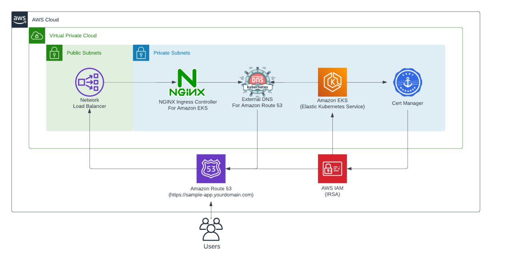

```markdown
# 🚀 Fully Automated Kubernetes Infrastructure on AWS with Terraform

This project provisions a production-grade EKS-based Kubernetes infrastructure using Terraform. It includes automated setup for:

- 🧩 **Amazon EKS**
- 🌐 **ALB Ingress Controller**
- 🔐 **cert-manager** for automated SSL
- 🌍 **ExternalDNS** for Route 53 DNS management
- 🎯 **ArgoCD** to deploy applications using GitOps
- 📦 **Custom Domain Support**  Route 53

---


## 🗂️ Architecture Overview


 
### Components

| Component         | Description |
|------------------|-------------|
| **VPC**           | Custom VPC with public and private subnets across AZs |
| **EKS Cluster**   | Managed Kubernetes cluster |
| **ALB Controller**| Ingress management using AWS ALB |
| **cert-manager**  | Auto-generates SSL certificates via ACM or Let's Encrypt |
| **ExternalDNS**   | Auto-creates Route 53 records for Ingress |
| **ArgoCD**        | GitOps CD tool to manage app deployments |
| **Route 53**      | DNS and domain name management |


---

## 🛠️ Prerequisites

- ✅ AWS Account with programmatic access
- ✅ Terraform CLI 
- ✅ kubectl + aws CLI
- ✅ Helm CLI
- ✅ Domain Route 53 
- ✅ S3 backend bucket for Terraform (optional but recommended)

---

---

## 🚀 Deployment Steps

### Initialize Terraform

```bash
terraform init
```

---

### Review Plan

```bash
terraform plan
```

---

### Apply Infrastructure

```bash
terraform apply --auto-approve
```

Terraform will create:

* VPC, subnets, EKS cluster
* IAM roles for ALB, cert-manager, ExternalDNS
* Helm releases for ALB Controller,Ingress Controller, cert-manager, ExternalDNS, and ArgoCD
* DNS records in Route 53
* SSL certificate via cert-manager 
* ArgoCD with Ingress and SSL for custom domain 

---

## 🔒 SSL Certificate with cert-manager

The `cert-manager` module creates:

* **ClusterIssuer** or **Issuer**
* Validates via DNS (Route 53)
* Issues wildcard or specific domain certificates
* Adds annotations to Ingress resources for HTTPS

---

## 🌐 DNS Automation with ExternalDNS

ExternalDNS automatically creates Route 53 DNS records for:

* ArgoCD
* Application Ingresses
* Wildcard domains (if configured)

DNS records are created using IRSA IAM role with `route53:*` permissions on your hosted zone.

---

## 🎯 Application Deployment with ArgoCD

Once ArgoCD is installed:

1. Access ArgoCD:

```bash
kubectl port-forward svc/argocd-server -n argocd 8080:443
```

Or visit: `https://argocd.example.com`

2. Login:

```bash
kubectl get secret argocd-initial-admin-secret -n argocd -o jsonpath="{.data.password}" | base64 -d
```

3. Create an `Application` pointing to your Git repo.

Example Application manifest:

```yaml
apiVersion: argoproj.io/v1alpha1
kind: Application
metadata:
  name: my-app
  namespace: argocd
spec:
  destination:
    server: https://kubernetes.default.svc
    namespace: default
  source:
    repoURL: https://github.com/your-org/your-app-repo
    targetRevision: HEAD
    path: k8s
  project: default
  syncPolicy:
    automated:
      prune: true
      selfHeal: true
```

---

## 🧹 Cleanup

To delete all resources:

```bash
terraform destroy --auto-approve
```

---

## 📌 Notes

* ALB Controller and ExternalDNS use **IRSA** (IAM Role for Service Accounts)
* cert-manager supports **DNS-01** validation via Route 53
* All components are deployed via **Helm** using Terraform Helm provider
* ArgoCD is secured with HTTPS and can be accessed via a custom domain

---

## 🔗 References

* [AWS EKS](https://docs.aws.amazon.com/eks/latest/userguide/what-is-eks.html)
* [cert-manager](https://cert-manager.io/docs/)
* [ExternalDNS](https://github.com/kubernetes-sigs/external-dns)
* [ArgoCD](https://argo-cd.readthedocs.io/en/stable/)
* [ALB Ingress Controller](https://kubernetes-sigs.github.io/aws-load-balancer-controller/latest/)

---

